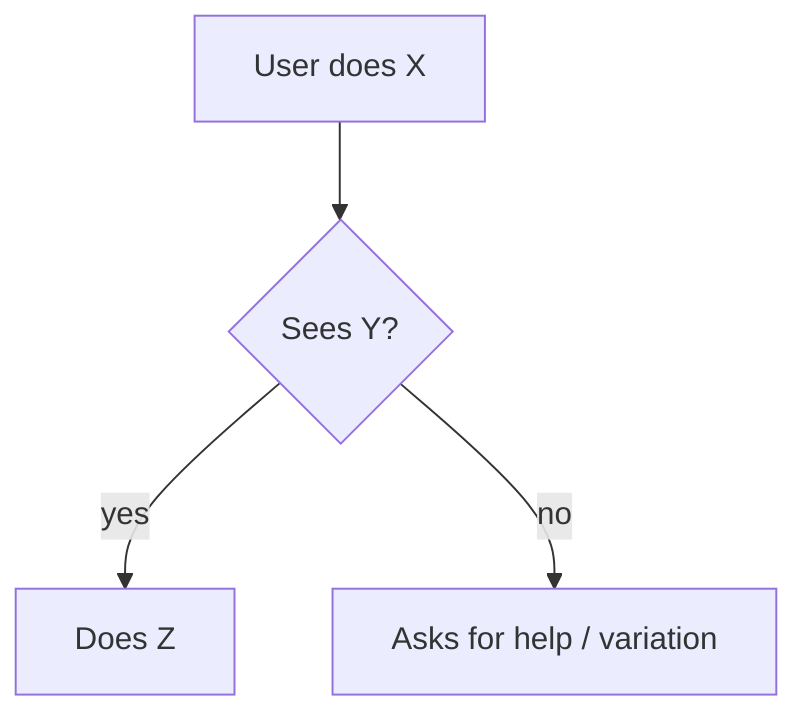

*Generic template from the Claude starter kit — adapt to this project. Replace `{{TOKENS}}`; see `bootstrap/PLACEHOLDERS.md`.*

# SPEC-<DOMAIN>-NNN: <Feature name>

**Status:** Draft | Confirmed | Implemented | Superseded
**Owner:** <who answers questions about this spec>
**Revision:** <n> — YYYY-MM-DD
**Source:** <originating interview question(s), qualified Q-IDs: `001/Q-SCOPE-02`>
**Personas:** <names from `docs/PERSONAS.md` — reference by name, never redefine here>

## Journey

<Audience: a non-technical stakeholder. Plain language only — user actions and
what they see, no table names, no jargon. The test: the persona's real-world
counterpart reads this layer alone and says "yes, that's what should happen."
This layer is shareable standalone.>

**Goal:** <what the persona is trying to get done, in their words>

**Steps (happy path):**
1. <user action → what they see happen>
2. <…>

**Variations:** <alternate paths that still succeed, in plain language>

## Technical spec

<Audience: AI, developers, UAT.>

**Preconditions:** <state that must hold before the journey starts — auth, data, config>

**Data touchpoints:**

| Step | Entity / table | Read / write | Notes |
|---|---|---|---|
| 1 | | | |

**Business rules:**
- **BR-1** — <rule, stated testably>
- **BR-2** — <…>

**Edge cases:**

| ID | Scenario | Expected behavior |
|---|---|---|
| EC-1 | <invalid input / empty state / boundary / permission denied> | |

**Open questions:** <unresolved items — each should trace to an interview question or tracked issue>

---

*UAT traceability: acceptance criteria for this feature cite journey step
numbers and edge-case IDs (EC-n) from this spec. Keep-current: any PR that
changes this feature's behavior updates this spec in the same PR.*
