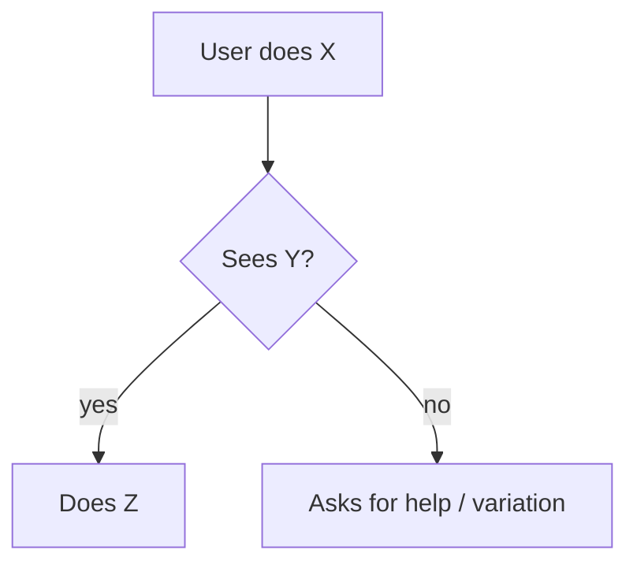

*Generic template from the Claude starter kit — adapt to this project. Replace `{{TOKENS}}`; see `bootstrap/PLACEHOLDERS.md`.*

# SPEC-<DOMAIN>-NNN: <Feature name>

**Status:** Draft | Confirmed | Implemented | Superseded
**Owner:** <who answers questions about this spec>
**Revision:** <n> — YYYY-MM-DD
**Source:** <originating interview question(s), qualified Q-IDs: `001/Q-SCOPE-02`>
**Personas:** <names from `docs/PERSONAS.md` — reference by name, never redefine here>

> **Self-contained and environment-agnostic.** This spec states *what* must be
> true. It **refers to** existing ADRs and decisions by ID; it never **prescribes**
> an ADR, an architecture, a physical data model, or a decision-log entry — those
> are decided at development assessment, by whoever holds the architectural
> context. Why, and what that excludes: `docs/specs/README.md`.

## Journey

<Audience: a non-technical stakeholder. Plain language only — user actions and
what they see, no table names, no jargon. The test: the persona's real-world
counterpart reads this layer alone and says "yes, that's what should happen."
This layer is shareable standalone.>

**Goal:** <what the persona is trying to get done, in their words>

**Steps (happy path):**
1. <user action → what they see happen>
2. <…>

```mermaid
flowchart TD
    A[User does X] --> B{Sees Y?}
    B -- yes --> C[Does Z]
    B -- no --> D[Asks for help / variation]
```

**Variations:** <alternate paths that still succeed, in plain language>

## Technical spec

<Audience: AI, developers, UAT, independent reviewers.>

**Feature decisions:**

| ID | Decision | Reasoning |
|---|---|---|
| FD-1 | <what was decided about this feature> | <why — name the option not taken> |

<Feature-level choices only, with the reasoning that produced them. A choice
that needs architectural context is *raised* here as an open question and
decided at assessment — never made here.>

**Referenced decisions:** <existing ADRs / decision-log entries this feature
relies on, by ID. Referenced, never restated — the source moves, this list doesn't.>

**Preconditions:** <state that must hold before the journey starts — auth, data, config>

**Data touchpoints:**

| Step | Entity / concept | Read / write | Notes |
|---|---|---|---|
| 1 | | | |

<Conceptual entities as the feature talks about them. The binding to physical
tables and columns is made at development assessment, not here.>

**Invariants:**

| ID | Must always hold | Evidence that proves it |
|---|---|---|
| INV-1 | <e.g. no actor reads another organisation's records under any request shape> | <storage read / captured response / fresh-read snapshot> |

<Declared as rows, never buried in prose: these are the assertions that hold
under *any* input, role, or request shape — not just the happy path. State each
so one counter-example falsifies it, and name the artefact that would prove it.
An invariant nobody can name evidence for is a business rule, not an invariant.>

**Business rules:**

<State the *requirement*, not how to build it. A requirement may itself be a
procedure ("confirm twice before deleting") — that is still what must be true.
Either way the testable question is "can we do it the way specified?">

- **BR-1** — <rule, stated so a single counter-example falsifies it>
- **BR-2** — <…>

**Non-functional requirements:**

- **NFR-1** — <performance / availability / privacy / accessibility target, with a number where one exists>

<An NFR that must hold under *every* input rather than on average is an
invariant — declare it in the table above so it can be checked, and leave the
measurable targets here.>

**UX clauses:**

- **UX-1** — <e.g. no wording implies the persona failed when a search legitimately returns nothing>

<Feature-specific wording, tone, and presentation rules — filed here rather than
as business rules, because they are checked against the running UI, not against
stored data. Project-wide rules live in `ai/STANDARDS/UI_STANDARD.md`; only what
is specific to this feature belongs here.>

**Edge cases:**

| ID | Scenario | Expected behavior |
|---|---|---|
| EC-1 | <invalid input / empty state / boundary / permission denied> | |

**Diagrams:** <use the notation that fits the shape — a spec is not limited to
one flowchart. Mermaid `stateDiagram-v2` for a lifecycle with states and
transitions; `erDiagram` for how entities relate; `sequenceDiagram` for a handoff
across actors or systems over time; `flowchart` for a branching path; a plain
markdown table where the thing is tabular. Where markdown genuinely cannot
express it, use a representation that can and reference it here.>

**Open questions:** <unresolved items — each should trace to an interview question or tracked issue>

---

*UAT traceability: acceptance criteria for this feature cite journey step
numbers, edge-case IDs (EC-n), and invariants (INV-n) from this spec.
Keep-current: any PR that changes this feature's behavior updates this spec in
the same PR.*
