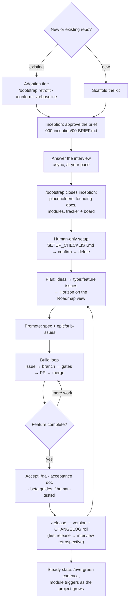

# The Kit Workflow — where you are and what's next

The end-to-end journey of a project built with the starter kit, written for
someone using it for the first time. The companion reference — what the kit
*is*, every command, the directory map — is `docs/kit/README.md`.

## The flow

## The stages

1. **Scaffold.** A new project gets the kit's core at inception; optional
   modules (db, ui, reports, deploy-ci, sla) arrive staged, installed later
   when their trigger fires. An existing repo instead picks an adoption tier:
   `/bootstrap` retrofit (just missing kit pieces), `/conform` (untidy naming/
   layout/tracker), `/rebaseline` (sound concept, rebuild the implementation).

2. **Inception — brief first.** Before any questions, the AI drafts (or you
   write) the project brief — `00-BRIEF.md` in the `000-inception/` interview
   directory under `docs/plans/`: what this project is, for
   whom, goals, out-of-scope, known constraints. You edit until it says what
   you mean, then approve it. Only then is the interview generated, seeded by
   the brief. Answer it async in the files — sessions resume; defaults cover
   what you defer.

3. **Close inception with `/bootstrap`.** Fills every `{{PLACEHOLDER}}`,
   generates the founding docs (README, LICENSE, ADRs, decision log,
   compliance register, glossary, personas), offers the modules that apply
   now, and sets up labels + the project board (Status lifecycle, Horizon
   field, saved views).

4. **Human-only setup.** `/bootstrap` writes `SETUP_CHECKLIST.md` at the repo
   root: tokens, API keys, `gh` scopes, CI secrets, board UI-only steps — with
   instructions and alternatives. Work through it; when everything's
   confirmed, the AI offers to delete it. **This is the point where "what do I
   do now?" flips from setup to building.**

5. **Plan the work.** Ideas land as `type:feature` issues (lightweight — what,
   who asked, why) and get ordered by **Horizon** (Now / Next / Later) on the
   board's Roadmap view. Nothing is a document; the roadmap is a view over
   live issues (`ai/STANDARDS/ROADMAP_STANDARD.md`).

6. **Promote and spec.** When a feature's turn comes it grows its full
   two-layer body or becomes an epic with sub-issues
   (`ai/STANDARDS/TASK_ISSUE_STANDARD.md`), and a journey-first spec in
   `docs/specs/` — **specs are per-feature, created at promotion, not at
   bootstrap**. Epic-sized work can run its own interview
   (`001-<slug>/`, same machinery as inception).

7. **The build loop** — the kit deliberately does not prescribe your inner
   development style (TDD, spike-and-stabilize, whatever fits); it prescribes
   the *rails around it*:
   pick an issue from the board (Next) → set it In progress → branch
   `<type>/<issue#>-<slug>` → build, reading the relevant
   `ai/STANDARDS/` file for the area → gate completion with
   `ai/CHECKLISTS/` → `/preflight` → PR (`Closes #N`, CHANGELOG line) →
   squash-merge → board Done.

8. **Accept.** `/qa`, `/security`, `/compliance`, `/perf` as the change
   warrants; feature-complete work gets its acceptance doc, and human beta
   testing (reports module) gets goals-not-steps beta guides.

9. **Release.** `/release` bumps versions in lockstep and rolls the
   CHANGELOG. The **first release triggers the interview retrospective**:
   "what did the interview fail to ask?" — gaps become port-back issues
   against the kit.

10. **Steady state.** The session-start protocol (`ai/agent-setup.md`) keeps
    the board honest; `/evergreen` runs its six lenses on a ~30-day cadence;
    module triggers fire as the project grows (first schema → db, first UI
    code → ui, first deploy target → deploy-ci).

## Where am I?

| You see… | You're at | Do |
|---|---|---|
| `{{TOKENS}}` everywhere, no `000-inception/` | Stage 2 | `/bootstrap` (starts the brief) |
| A brief marked `draft` | Stage 2 | Edit it, approve it |
| Interview files with `open` questions | Stage 2 | Answer them, then `/bootstrap` |
| Interview done, tokens still unfilled | Stage 3 | `/bootstrap` |
| `SETUP_CHECKLIST.md` at the root | Stage 4 | Work through it, confirm, delete |
| Empty board, no feature issues | Stage 5 | File ideas as `type:feature`, set Horizon |
| A promoted feature with no spec | Stage 6 | Write the spec, break down the work |
| An issue assigned to you / In progress | Stage 7 | Build inside the rails |
| `## [Unreleased]` full of entries | Stage 9 | `/release` |
| Nothing urgent | Stage 10 | Session-start checks; `/evergreen` if due |

## Right-sizing — the same flow at three scales

The stages never change; their weight does (recommendations in the interview
are right-sized the same way — smallest thing that works).

- **Weekend tool / personal project:** brief = a paragraph; accept interview
  defaults liberally (`deferred` is a legitimate end state); no epics — plain
  task issues; releases whenever it's useful; modules likely never trigger.
- **Small real product:** the full flow as written; epics for multi-issue
  features; release cadence tied to beta rounds.
- **Team / multi-audience product:** add epic interviews per major feature,
  persona-addressed beta guides, compliance register worked actively, and
  the roadmap view shared with stakeholders.
